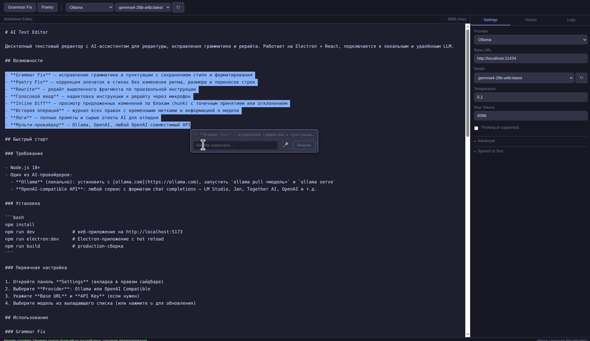

# AI Text Editor

Десктопный текстовый редактор с AI-ассистентом для редактуры, исправления грамматики и рерайта. Работает на Electron + React, подключается к локальным и удалённым LLM.



## Возможности

- **Grammar Fix** — исправление грамматики и пунктуации с сохранением стиля и форматирования
- **Poetry Fix** — коррекция опечаток в стихах без изменения ритма, размера и переносов строк
- **Rewrite** — рерайт выделенного фрагмента по произвольной инструкции
- **Голосовой ввод** — надиктовка инструкции к рерайту через микрофон
- **Inline Diff** — просмотр предложенных изменений по блокам (hunk) с точечным принятием или отклонением
- **История операций** — журнал всех правок с временными метками и информацией о модели
- **Логи** — полные промпты и сырые ответы AI для отладки
- **Мульти-провайдер** — Ollama, OpenAI, любой OpenAI-совместимый API

## Быстрый старт

### Требования

- Node.js 18+
- Один из AI-провайдеров:
  - **Ollama** (локально): установить с [ollama.com](https://ollama.com), запустить `ollama pull <модель>` и `ollama serve`
  - **OpenAI-compatible API**: любой сервис с форматом chat completions — LM Studio, Jan, Together AI, OpenAI и т.д.

### Установка

```bash
npm install
npm run dev              # веб-приложение на http://localhost:5173
npm run electron:dev     # Electron-приложение с hot reload
npm run build            # production-сборка
```

### Первичная настройка

1. Откройте панель **Settings** (вкладка в правом сайдбаре)
2. Выберите **Provider**: Ollama или OpenAI Compatible
3. Укажите **Base URL** и **API Key** (если нужен)
4. Выберите модель из выпадающего списка (или нажмите ↻ для обновления)

## Использование

### Grammar Fix

1. Вставьте или напишите текст
2. Выделите нужный фрагмент — или оставьте без выделения, чтобы обработать весь документ
3. Нажмите **Grammar Fix** (или **Poetry Fix** в режиме Poetry)
4. Просмотрите предложенные изменения в инлайн-диффе
5. Принимайте или отклоняйте изменения по блокам, либо всё сразу

### Rewrite

1. Выделите текст, который нужно переписать
2. В появившемся popup-е введите инструкцию — или нажмите 🎤 и надиктуйте её
3. Нажмите **Rewrite**
4. Просмотрите и примите изменения

### Poetry Mode

Включите **Poetry** в тулбаре. Grammar Fix в этом режиме исправляет только орфографические ошибки и опечатки, не трогая переносы строк, ритм и структуру.

## Голосовой ввод

При выделении текста появляется popup для рерайта. Кнопка 🎤 запускает запись голосовой инструкции.

Провайдер распознавания речи настраивается в **Settings → Speech to Text**:

| Провайдер | Описание |
|---|---|
| **Web Speech (built-in)** | Встроенный в браузер/Electron API. Нулевая настройка, требует интернет |
| **Local Whisper** | Локальный сервер на базе [faster-whisper](https://github.com/SYSTRAN/faster-whisper). Офлайн, высокое качество |
| **OpenAI Compatible** | Любой STT-сервис с форматом `/v1/audio/transcriptions` — OpenAI Whisper API и совместимые |

По умолчанию используется **Web Speech** — работает сразу без дополнительной настройки.

## Структура проекта

```
src/
  core/
    audio/          # запись звука (WAV encoder, AudioRecorder)
    stt/            # подсистема Speech-to-Text (провайдеры, интерфейс, фабрика)
    operations/     # операции: grammar fix, rewrite, poetry fix
    providers/      # AI-провайдеры: Ollama, OpenAI Compatible
    diff/           # движок вычисления диффов
    document/       # управление состоянием документа
    history/        # история операций
    logging/        # журнал API-запросов
    prompts/        # реестр промптов
  components/
    Editor/         # текстовый редактор с инлайн-диффом
    Toolbar/        # панель управления
    Settings/       # настройки провайдеров и STT
    History/        # история операций
    Logs/           # логи API-запросов
  hooks/            # React-хуки (useSpeechToText и др.)
electron/           # Electron main process и preload
```

## Решение проблем

**Модель возвращает пустой ответ**
- В Ollama: убедитесь, что модель загружена — `ollama pull <model>`
- Проверьте, что Ollama запущена: `curl http://localhost:11434/api/tags`

**"Model ran out of tokens while thinking"**
- Увеличьте **Max Tokens** в Settings или отключите **Thinking**

**Голосовой ввод не работает**
- *Web Speech*: убедитесь, что браузер имеет доступ к микрофону и есть интернет
- *Local Whisper*: проверьте, что сервер запущен; нажмите **Test connection** в Settings → Speech to Text
- *Dev-режим (браузер)*: Vite автоматически проксирует запросы к `localhost:8000`; перезапустите `npm run dev` после смены настроек

**CORS-ошибки при работе в браузере**
- Vite proxy покрывает `/transcribe` и `/v1` для `localhost:8000` — этого достаточно для дефолтной конфигурации
- Для кастомных URL добавьте нужный маршрут в `vite.config.ts` → `server.proxy`
- В Electron-сборке CORS-ограничения отключены

## Лицензия

MIT
